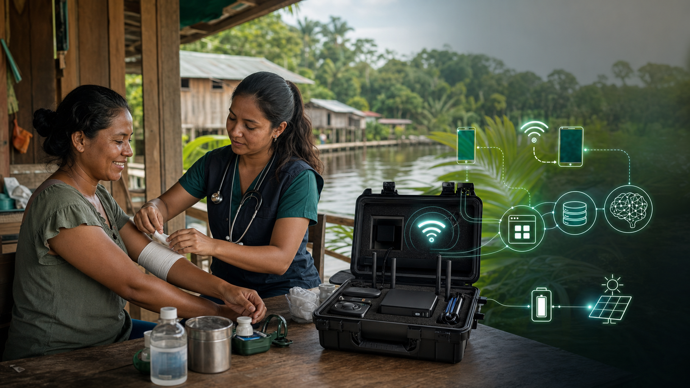
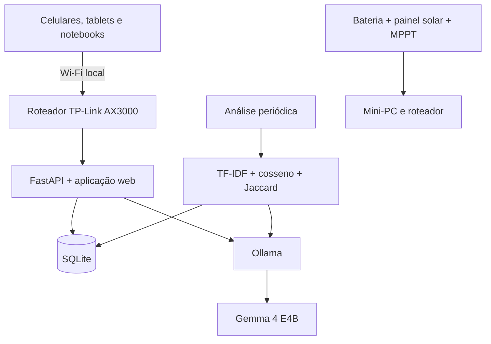

# NÚCLEO — IA clínica onde o cuidado precisa continuar



> Plataforma portátil de apoio clínico com **Gemma 4 E4B**, projetada para funcionar localmente em comunidades remotas.

## Responsáveis pelo projeto

- **DAVI FERNANDES MESQUITA**
- **DANIEL DOS SANTOS DOURADO**
- **BRYAN TORRES RIBEIRO**

[](#status-do-projeto)
[](#gemma-4-e4b)
[](#arquitetura)

## Visão geral

Em comunidades remotas, o atendimento médico pode ocorrer de forma periódica, enquanto agentes de saúde e outros profissionais permanecem acompanhando a população. O desafio não é apenas realizar uma consulta: é garantir que o histórico, as imagens, os sinais vitais e as decisões tomadas continuem disponíveis quando outro profissional assumir o atendimento.

Quando os registros ficam espalhados em fichas físicas ou equipamentos diferentes, a evolução clínica se torna difícil de acompanhar, casos prioritários podem se misturar aos atendimentos comuns e relações entre pacientes da mesma comunidade podem permanecer invisíveis.

O **NÚCLEO** responde a essa dor com uma infraestrutura clínica local que permanece junto à comunidade. A solução reúne aplicação web, prontuário eletrônico, banco de dados e inteligência artificial em um mini-PC acessível pela rede Wi-Fi da unidade, sem depender de APIs externas ou serviços em nuvem.

A aplicação já está implementada, encontra-se em execução e pode ser utilizada em uma demonstração funcional.

> [!IMPORTANT]
> O NÚCLEO é uma ferramenta de apoio. Ele não produz diagnóstico autônomo e não substitui médicos, nutricionistas ou outros profissionais habilitados. Toda saída clínica da IA permanece sujeita à revisão humana.

## O que a plataforma faz

### Triagem assistida

O sistema recebe sintomas, sinais vitais, histórico, comunidade e identificação de quem realizou o registro. O Gemma organiza os dados e sugere:

- classificação de risco: `baixo`, `moderado`, `alto` ou `crítico`;
- especialidade relacionada ao caso;
- justificativa da classificação;
- nível de confiança da resposta.

A classificação entra em uma fila de pendências e só é encerrada depois da revisão profissional.

### Três interfaces de atendimento

| Interface | Rota | Finalidade |
|---|---|---|
| Painel médico | `/` | Cadastro, fila de pendências, alertas, prontuários e revisão das respostas da IA |
| Apoiador de campo | `/apoiador` | Registro de casos por agentes e profissionais presentes na comunidade |
| Paciente | `/paciente` | Autoatendimento simplificado, sem exposição direta da classificação clínica bruta |
| Ficha completa | `/ficha/{id}` | Histórico consolidado do atendimento e das revisões realizadas |

### Análise preliminar de imagens

Fotografias de feridas ou lesões podem ser anexadas ao atendimento. O Gemma 4 E4B produz uma descrição visual preliminar, armazenada separadamente da classificação de risco, para que o médico compare a resposta com a imagem original e confirme ou corrija a avaliação.

### Prontuário local

Os atendimentos permanecem armazenados no banco local da unidade. Isso permite que um médico que retorne posteriormente à comunidade consulte registros, imagens, classificações, correções e orientações anteriores sem precisar reconstruir o caso do início.

### Apoio nutricional

O sistema gera sugestões considerando condição relatada, alergias e alimentos acessíveis em comunidades rurais. As orientações permanecem pendentes até a validação de um profissional.

### Análise coletiva em segundo plano

A cada dez minutos, um processo em segundo plano consulta fichas recentes da mesma comunidade e procura grupos com sintomas semelhantes.

A detecção combina:

1. **TF-IDF e similaridade de cosseno** sobre as queixas em texto livre;
2. **índice de Jaccard** sobre os sintomas estruturados;
3. agrupamento de registros relacionados;
4. uso do Gemma apenas para descrever o grupo estatisticamente identificado.

O sistema não confirma surtos. Ele revela relações entre fichas e cria um alerta verificável pela equipe, com acesso aos pacientes e atendimentos envolvidos.

## Gemma 4 E4B

O modelo `gemma4:e4b` é executado localmente pelo [Ollama](https://ollama.com/). Ele é o núcleo de IA do projeto e participa de diferentes fluxos:

- organização e classificação assistida da triagem;
- análise combinada de texto e imagem;
- sugestão de especialidade;
- justificativa estruturada em JSON;
- apoio nutricional;
- descrição dos agrupamentos de sintomas encontrados pelo processo estatístico.

O backend se comunica com a API REST local do Ollama. Nenhum dado clínico precisa ser enviado para um provedor externo durante a operação normal.

## Arquitetura



### Stack

| Camada | Tecnologia |
|---|---|
| Modelo multimodal | Gemma 4 E4B via Ollama |
| Backend | Python 3.12, FastAPI e Uvicorn |
| Banco de dados | SQLite e SQLAlchemy 2.0 |
| Validação | Pydantic 2.10 |
| Processo periódico | APScheduler |
| Similaridade | scikit-learn: TF-IDF, cosseno e Jaccard |
| Frontend | HTML, CSS e JavaScript sem frameworks ou CDNs |

## Status do projeto

- [x] Aplicação web funcional
- [x] Integração local com Gemma 4 E4B
- [x] Triagem por texto
- [x] Análise de imagem
- [x] Fila de revisão profissional
- [x] Prontuário local
- [x] Apoio nutricional
- [x] Análise periódica de sintomas semelhantes
- [x] Interfaces para médico, apoiador e paciente
- [ ] Validação de capacidade no mini-PC final
- [ ] Teste real de autonomia energética
- [ ] Avaliação clínica e regulatória para uso fora de demonstração

## Como executar

### Pré-requisitos

- Python 3.12;
- Ollama instalado e em execução;
- aproximadamente 10 GB livres para o modelo e os arquivos locais.

### Instalação

```bash
git clone git@github.com:cybermazinho/ECO-HACK-NUCLEO-GEMMA.git
cd ECO-HACK-NUCLEO-GEMMA

python3 -m venv venv
./venv/bin/pip install -r requirements.txt

ollama pull gemma4:e4b
```

### Inicialização

Com o Ollama ativo, execute:

```bash
./venv/bin/uvicorn app.main:app --host 0.0.0.0 --port 8010
```

Acesse:

- aplicação: <http://localhost:8010>;
- apoiador: <http://localhost:8010/apoiador>;
- paciente: <http://localhost:8010/paciente>;
- documentação da API: <http://localhost:8010/docs>.

Em outro dispositivo conectado à mesma rede, substitua `localhost` pelo endereço IP do mini-PC.

### Dados sintéticos para demonstração

Com o servidor em execução:

```bash
./venv/bin/python data/seed_patients.py --base-url http://localhost:8010
```

O script cria pacientes e fichas sintéticas, incluindo registros semelhantes para demonstrar a análise coletiva.

> [!WARNING]
> Não use dados reais de pacientes em ambientes de demonstração. O banco `nucleo.db` e a pasta `uploads/` são dados locais de execução e não devem ser versionados.

## Hardware e cenário simulado

Configuração proposta para a maleta:

- mini-PC GMKtec com Ryzen 7 7730U;
- 32 GB de RAM;
- SSD NVMe de 1 TB;
- roteador TP-Link AX3000;
- bateria LiFePO₄ de 12 V e 50 Ah;
- inversor de 300 W;
- painel solar de 100 W;
- controlador MPPT, carregador, cabos e proteções.

As capacidades abaixo são **simulações de dimensionamento**, não resultados medidos no equipamento final:

| Parâmetro simulado | Estimativa |
|---|---:|
| Dispositivos conectados | 50–100 |
| Profissionais trabalhando | 20–40 |
| Usuários utilizando IA simultaneamente | 5–10 |
| População atendida por unidade | 500–2.000 pessoas |
| Autonomia energética | meta de até 16 horas |
| Cobertura Wi-Fi em campo aberto | 100–200 metros |

A bateria possui capacidade nominal aproximada de 600 Wh. A autonomia real depende do consumo do mini-PC, do roteador, da frequência de inferências e das perdas elétricas.

## Custo simulado

O orçamento considera o pior cenário: uma unidade sem servidor, rede ou infraestrutura energética. Se o local já possuir energia, bateria, sistema solar ou rede Wi-Fi, os itens correspondentes podem ser retirados e o investimento pode cair para aproximadamente metade do cenário mais conservador.

| Componente | Valor simulado |
|---|---:|
| GMKtec Ryzen 7 7730U, 32 GB RAM e SSD de 1 TB | R$ 2.200,00 |
| Bateria LiFePO₄ 12 V 50 Ah | R$ 1.000,00 |
| Inversor 300 W | R$ 350,00 |
| Painel solar 100 W | R$ 500,00 |
| Controlador MPPT | R$ 300,00 |
| Carregador | R$ 200,00 |
| Cabos e proteção | R$ 200,00 |
| Roteador TP-Link AX3000 | R$ 280,00 |
| **Total estimado em compra direta** | **R$ 5.030,00** |
| **Pior cenário com importação e tributos** | **R$ 9.081,60** |

## Benchmark de desenvolvimento

Teste realizado com o Gemma 4 E4B em uma máquina de desenvolvimento equipada com Ryzen 7 7700X e RTX 5070:

| Cenário | GPU RTX 5070 | CPU, 16 threads |
|---|---:|---:|
| Texto livre longo, aproximadamente 300 palavras | 12,4 s | 112,4 s |
| Classificação textual curta | 1,28 s | 11,1 s |
| Classificação com imagem | 2,14 s | aproximadamente 15–17 s |

Esses valores comprovam a execução local nessa máquina, mas não representam o desempenho do Ryzen 7 7730U previsto para a maleta. A validação final deve ser realizada no hardware-alvo.

## Estrutura do repositório

```text
app/                  API, banco de dados, integração com Gemma e análise coletiva
assets/               imagens e recursos visuais do projeto
data/                 dados sintéticos para demonstração
static/               interfaces web do médico, apoiador, paciente e ficha
requirements.txt      dependências Python
```

## Links

- **Repositório:** <https://github.com/cybermazinho/ECO-HACK-NUCLEO-GEMMA>
- **Demonstração pública:** <http://caad.ddns.me:8010/>
- **Aplicação local:** <http://localhost:8010>

## Licença

A licença do projeto ainda não foi definida.
